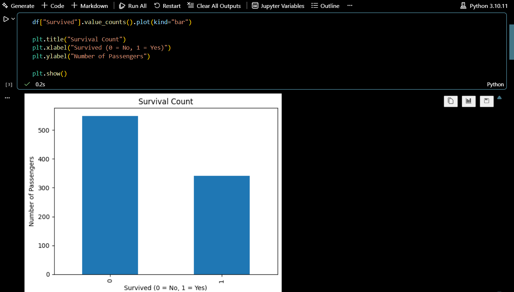
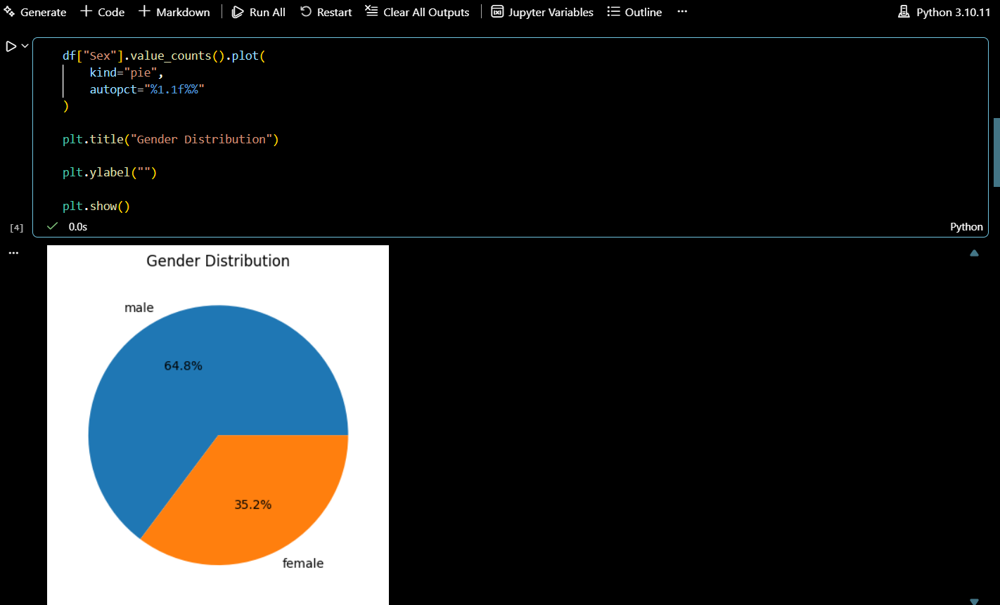
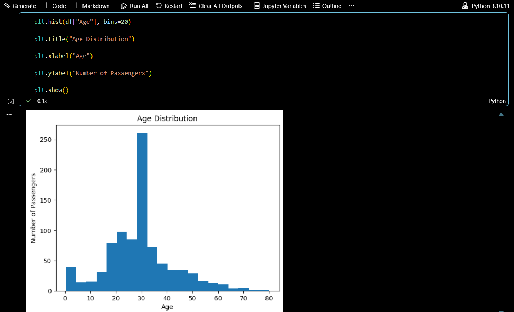
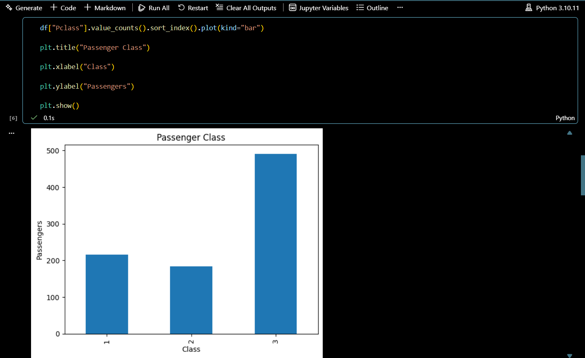
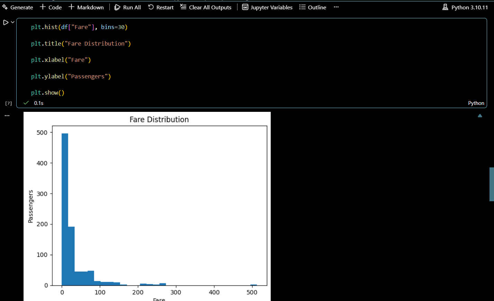
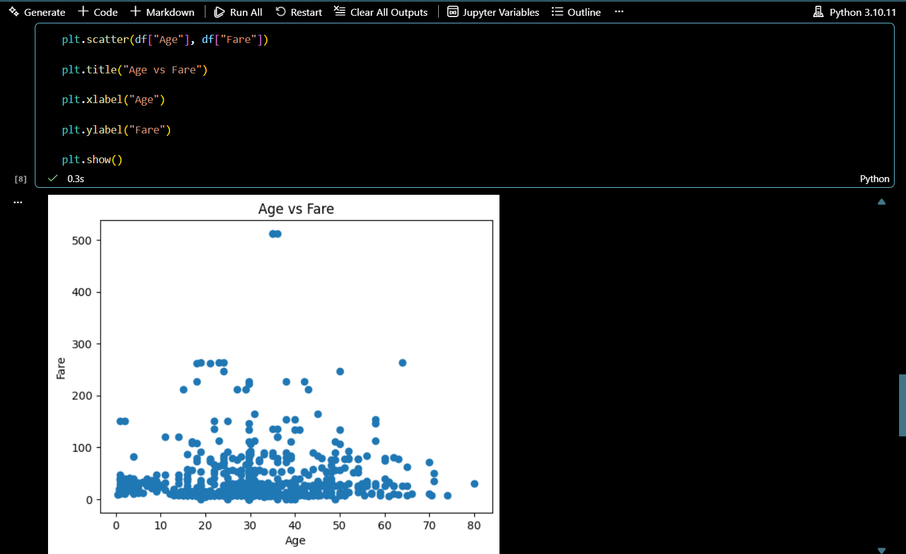

# CODSOFT_DATA_ANALYTICS
Data Analytics Internship Tasks completed using Python, Pandas and Matplotlib.
---

# 📸 Project Screenshots

## Survival Count

---

## Gender Distribution

---

## Age Distribution

---

## Passenger Class

---

## Fare Distribution

---

## Age vs Fare

